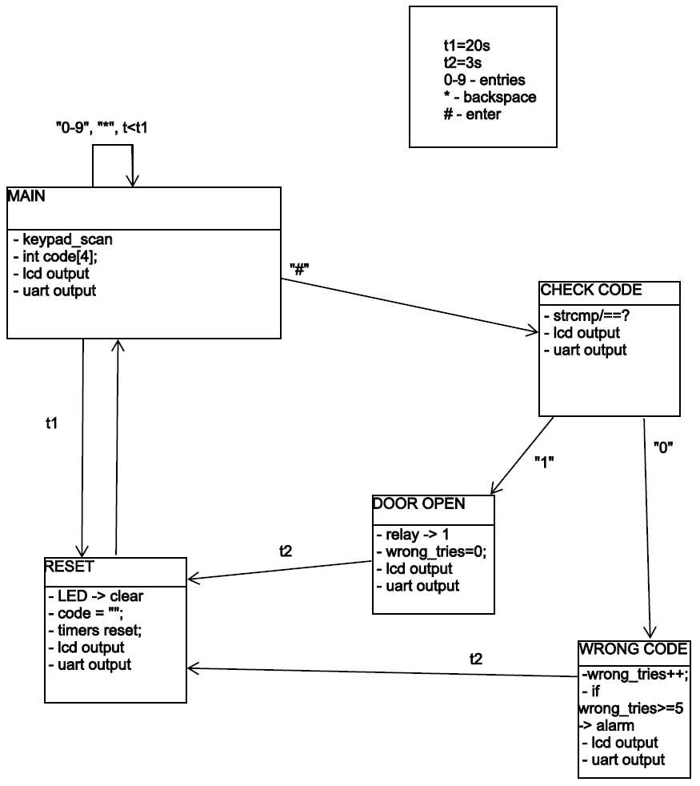
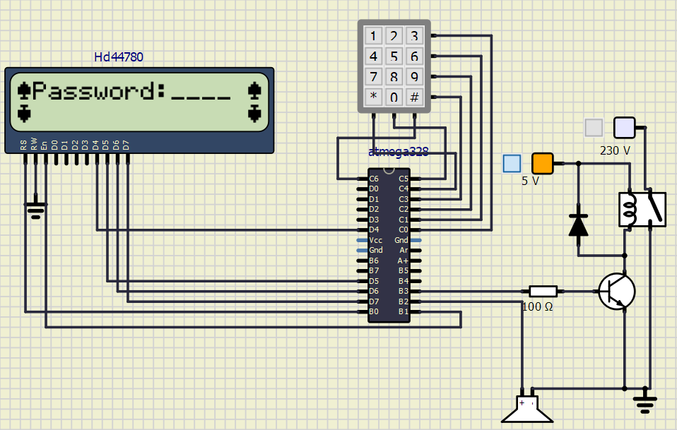
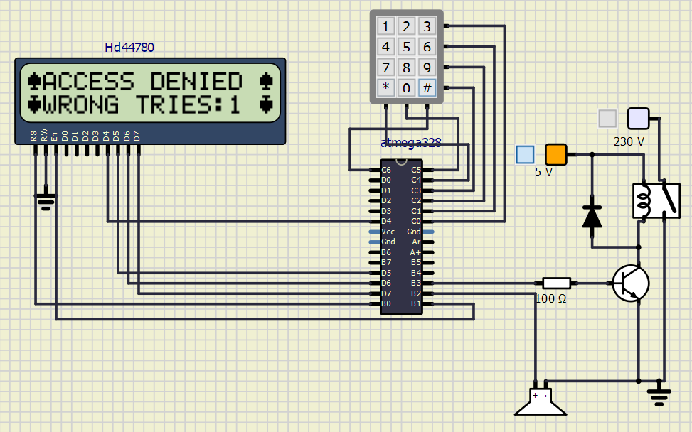
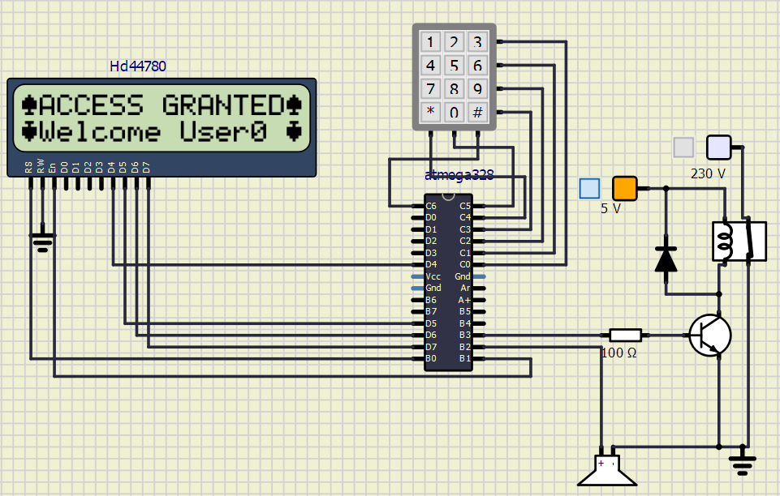

# DE2 project: Keypad simulation
Repository for the purposes of the BPC-DE2 course.

### Team members
Pastusek Vaclav, Michal Krystof
https://github.com/venca611/DE2_project

### Project objectives
The objective of this project was for us to learn to work with a 4x3 keypad in combination with a lcd Hd44780 and an Arduino Atmega328p microcontroller.

## Hardware description
- ATmega328P
- LCD Hd44780
- 4x3 keypad
## Code description and simulations
- State diagram

- Default state

- Partially written code

- Access denied

- Access granted

## Simulation video

